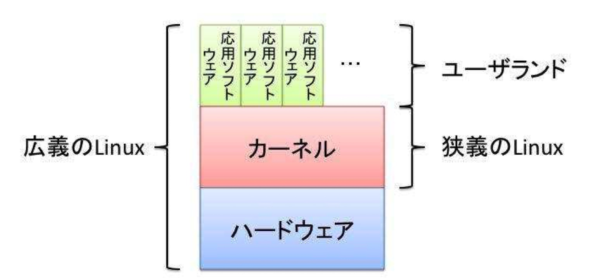
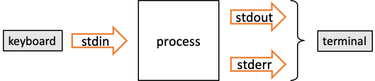
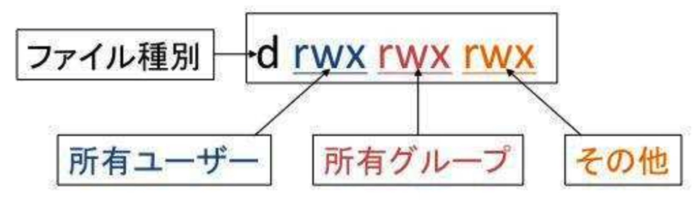

# Linux レポート

## OS

OS は「カーネル」，「ユーザランド」からなる．



- カーネル
  ハードウェアと直接やりとりするな どもっとも中心的な機能を受け持つ部分
- ユーザランド
  OS の中でカーネル以外の部分で，ファイルシステムやファイル操作コ マンド，シェルなどの基本的なソフトウェア群

## 標準入出力

### 入出力の基本

Linux のプログラムは以下のような 1 入力 2 出力である．

- 入力：
- 標準入力（キーボード）
- 出力：
- 標準出力
  プログラムの実行結果を書き出す先（プログラムを実行した端末）
- 標準エラー出力
  エラーメッセージを書き出す先（プログラムを実行した端末）



### リダイレクト（ > , >>）

リダイレクトを使うと標準出力，標準エラー出力をファイルに出力することができる．
" > "を使うと上書き
" >> "を使うと追記

- command の標準出力を file.txt に書き出す．1 は「標準出力」を表し，省略可能．
  標準エラー出力は民なるに表示される．

```bash
<command> 1> file.txt
<command> > file.txt
```


- command の標準エラー出力を file.txt に書き出す．2 は「標準エラー出力」を表す．
  標準出力はターミナルに表示される．

```bash
<command> 2> file.txt
```


- 標準出力と標準エラー出力を別々のファイルに出力する

```bash
<command> 1>result.txt 2>error.txt
```


- 標準出力と標準エラー出力を 1 つののファイルに出力する
  `2>$1`は「2 を 1 にリダイレクトする」ことを意味する．

```bash
<command> 1>output.txt 2>&1
```


### パイプ（ | ）

あるコマンドの出力を別のコマンドの標準入力として利用することができる．


`ls -la ~/`の長い出力を`less`に渡して 1 行ずつ確認する例

```bash
ls -la ~/ | less
```

### 検索（ grep ）

ファイルの中身を検索するコマンド．\<検索条件>として正規表現も使える． \<対象ファイル>には`/etc/*`のようにワイルドカードを使用して複数指定も可能．

```bash
grep <検索条件> <対象ファイル>
```

パイプを使って別コマンドの出力を標準入力として受け取り，それに対して検索することも可能．
以下の例は index が名前に含まれるファイルを検索することになる．

```bash
ls | grep index
```

## vi エディタ

コマンドモードでの操作を纏める

### 移動&INSERT モードへの切り替え

| 操作 | 挙動                                 |
| ---- | ------------------------------------ |
| i    | カーソルがある位置（文字の前）に入力 |
| I    | カーソルのある行の先頭に入力         |
| A    | カーソルのある行の末尾に入力         |

### コマンドモードでの移動&編集

| 操作 | 挙動                                                       |
| ---- | ---------------------------------------------------------- |
| :n   | n 行目に移動                                               |
| yy   | 1 行コピー                                                 |
| dd   | 1 行カット                                                 |
| p    | カーソルの次に 1 文字 or カーソルの次の行に 1 行をペースト |
| P    | カーソルの前に 1 文字 or カーソルの前の行に 1 行をペースト |
| u    | アンドゥ                                                   |

### 検索&置換

| 操作           | 挙動                                   |
| -------------- | -------------------------------------- |
| /単語          | 検索                                   |
| n              | 下方向に再検索                         |
| N              | 上方向に再検索                         |
| :●s/old/new    | ● 行目の最初の old を new に置換       |
| :●s/old/new/g  | ● 行目の全てのの old を new に置換     |
| :%s/old/new/g  | ファイル全体で置換                     |
| :%s/old/new/gc | ファイル全体で置換（置換のたびに確認） |

## パーミッション

パーミッションの種類

| 表記 | 意味    |
| ---- | ------- |
| r    | read    |
| w    | write   |
| x    | execute |

ファイル種別の種類

| 表記 | 意味               |
| ---- | ------------------ |
| -    | ファイル           |
| d    | ディレクトリ       |
| l    | シンボリックリンク |

パーミッションの表記



パーミッションの変更

```bash
chmod <設定値> <ファイル,ディレクトリ>
```


## その他コマンド

### less

```bash
less ファイル名
```

ファイルの中身を表示するコマンド．cat では全てが 1 度に表示されるが，less コマンドでは矢印キーなどで手動でスクロールしながら確認できる．
| 操作 | 挙動 |
| ---- | ---- |
| スペース | 次のページ |
| b | 前の 1 ページ |
| f | 次の 1 ページ |
| ↓, ↑ | 次の, 前の 1 行 |
| /単語 | 検索 |

### find

```bash
find ディレクトリ -name ファイル名
```

ディレクトリ内のファイルを検索しパスを表示する．ファイル名には`*`を使用できる．
