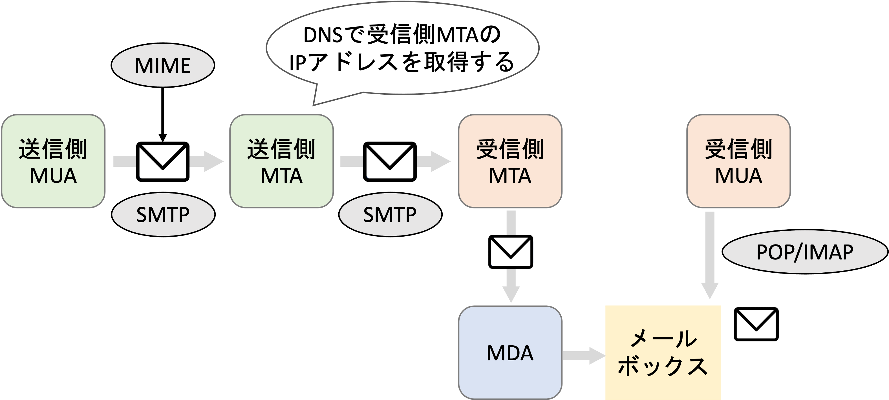

# メールプロトコル

## 用語

- MUA(mail user agent)
  ユーザーが使用するメールソフト
- MTA(mail transfer agent)
  メールサーバが持つメール転送サーバソフト。MUA から送られてきたメールを受け取り、宛先のメールサーバへ送信し、宛先のメールサーバで受け取るという一連の処理を担当する。
- MDA(mail delivery agent)
  MTA で受信したメールを宛先ユーザーのメールボックスに入れ、MUA で読み取れる形で保存する。あとはユーザがメールボックスを見にくるだけ。

## メール送信の全体像

## SMTP

メール送信のプロトコル。
サーバーとコマンドのやり取りをしてメールデータの送信を実現する。
コマンド　 → 　[コマンド] [空白] [パラメータ] [改行]
| コマンド | パラメータ | 意味 |
| ------- | --------- | --- |
| HELO | ホスト名（ドメイン名） | 接続の開始 |
| MAIL | FROM:<メールアドレス> | 送信元の通知 |
| RCTP | TO:<メールアドレス> | 宛先の通知 |
| DATA | なし | ここからドット改行までが本文 |
| QUIT | なし | 接続の終了 |

DATA 以外のものをエンベロープ（メール送信に必要な情報が入っている）と呼ぶ。
DATA は「ヘッダ」と「ボディ」からなり、ヘッダには To、From、Subject、Cc、Bcc などが設定できる。
【注意】
**_実際の宛先や送信元はエンベロープ FROM とエンベロープ TO で決まる_**。ヘッダ To とヘッダ From には実際の宛先や送信元を入れなくても良い（封筒の宛先と中の手紙に書かれている〇〇さんへの関係と似ている）。
Cc や Bcc がヘッダに設定されると、送信前に宛先がエンベロープ TO に追加される。Bcc のヘッダ情報は消される（Bcc でメールを受け取ると To にも Cc にも入っていないのはこのような動きのため）。

## POP

メールボックスの中身全てを MUA に **_移動させる_** プロトコル。移動後にはメールボックスの中身は削除される（MUA の設定によっては残すことや一部のメールだけ移動するなども可能）。移動後に削除されるので、一度メールを開くと別の PC の MUA ではメールを見るなどができない。
以下の 3 ステップで処理が行われる。

1. Authentication
   ユーザ ID とパスワードで認証を行う。平文で送信されるため、チャレンジアンドレスポンス方式で認証を行う APOP を使用することもできる。
2. Transaction
   メールの移動を行い、各メールに削除フラグを立てる。
3. Update
   削除フラグのあるメールを削除する

## IMAP

**_メールボックスを管理する_** プロトコル。
POP ではメールボックスはクライアントの MUA に保存するまでの維持保管場所となるが、IMAP ではメールボックスのメールを操作する（サーバー上のメールの閲覧、作成、削除、検索などができる）。

## MIME

メールは`US-ASCII`の符号化データしか運べない。
MIME は多言語や添付ファイルを`US-ASCII`に変換して運ぶ仕組み。MIME では BASE64 を使ってデータを英数字記号に変換している。
